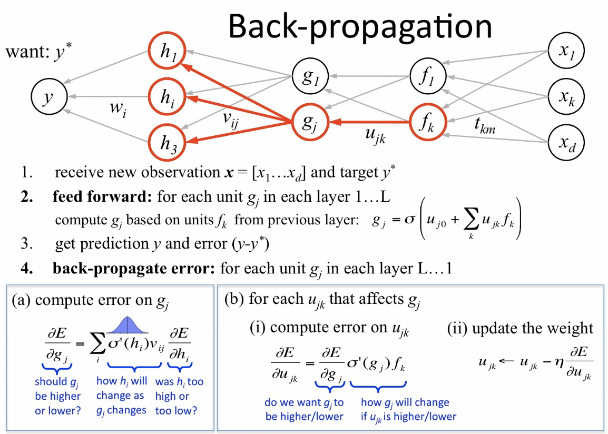

# History of AI: Technologies, Companies, and Products

## 1950s

- **Turing Test**: In 1950, Alan Turing proposed the Turing Test to determine whether a machine can exhibit intelligent behavior.

- **Artificial Intelligence (AI) term**: In 1956, John McCarthy coined the term "artificial intelligence" at the Dartmouth conference, marking the beginning of AI as a research field.

## 1960s

- **Early AI research**: In the 1960s, early AI research focused on developing problem-solving techniques, such as search algorithms, symbolic manipulation, and theorem-proving.

- **ELIZA**: Developed by Joseph Weizenbaum in 1964, ELIZA was an early natural language processing computer program that could simulate conversation.

- **SHRDLU**: Developed by Terry Winograd in 1968-1970, SHRDLU was a computer program that could understand and respond to queries about a virtual world of blocks.

## 1970s

- **Expert systems**: The 1970s saw the development of expert systems, which used knowledge-based approaches to solve complex problems. MYCIN, developed at Stanford University, was one of the earliest expert systems for diagnosing infectious diseases.

- **Speech recognition**: In the late 1970s, early speech recognition systems, such as the Harpy program at Carnegie Mellon University, were developed.

## 1980s

- **Machine learning**: The 1980s witnessed the rise of machine learning techniques, such as decision trees and neural networks, for building intelligent systems.

- **Backpropagation**: In 1986, Geoffrey Hinton, David Rumelhart, and Ronald Williams introduced the backpropagation algorithm, which significantly improved the training of neural networks.

- **Autonomous vehicles**: In the late 1980s, Carnegie Mellon University's Navlab project and the German Aerospace Center's EUREKA Prometheus Project started developing autonomous vehicle technology.

## 1990s

- **Deep Blue**: In 1997, IBM's Deep Blue chess computer defeated world champion Garry Kasparov, showcasing the potential of AI.
https://www.youtube.com/watch?v=KF6sLCeBj0s

- **Reinforcement learning**: During the 1990s, reinforcement learning techniques, such as Q-learning, were developed for training agents to make decisions based on rewards and penalties.

## 2000s

- **Natural language processing**: In the 2000s, natural language processing techniques, such as sentiment analysis and machine translation, gained prominence.

- **Siri**: In 2010, Apple acquired Siri, a virtual assistant, and integrated it into the iPhone, popularizing voice-activated AI assistants.

## 2010s

- **Deep learning**: The 2010s saw the rise of deep learning, which led to significant advancements in image and speech recognition.

- **ImageNet competition**: From 2010 to 2017, the ImageNet Large Scale Visual Recognition Challenge accelerated the development of AI for image recognition, with deep learning techniques dominating the competition.

- **AlphaGo**: In 2016, DeepMind's AlphaGo defeated the world champion Go player Lee Sedol, showcasing the potential of deep learning and reinforcement learning in AI.

- **Virtual assistants**: In the 2010s, virtual assistants like Google Assistant, Amazon Alexa, and Microsoft Cortana became popular consumer products.

- **Self-driving cars**: Companies like Tesla, Waymo, and Cruise Automation made significant advancements in autonomous vehicle technology during this decade.

- **GPT-2 and GPT-3**: OpenAI released its second-generation language model, GPT-2, in 2019, which could generate highly convincing text. In 2020

## >> [continue](2b.recenthistory.md)