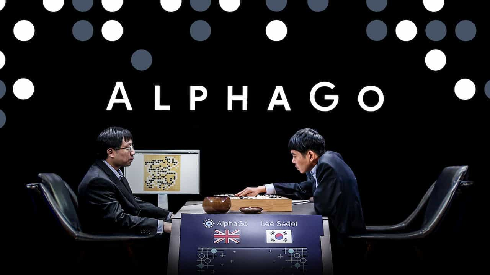
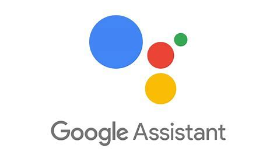

# AI Advancements in Recent Years

Artificial Intelligence (AI) has rapidly evolved in the past few years, revolutionizing the way we interact with technology. In this markdown, we will explore some of the major advancements in AI from 2017 to 2023, and their impact on the world.

## 2017

- **Transformers**
    - Attention is All You Need by Google

In 2017, Google released the paper "Attention is All You Need", introducing the Transformer, a neural network architecture for natural language processing. This new architecture, based on attention mechanisms, outperformed previous models on several tasks, including language translation.

## 2018

- **Google Assistant / Photos Maps News**
    - Incremental improvements

In 2018, Google made incremental improvements to its virtual assistant, Google Assistant, as well as to its Photos, Maps, and News services. These improvements included better natural language understanding, smarter recommendations, and more personalized experiences for users.

## 2019

- **NLP advancements**
- **AR search results**
- **OpenAI GPT-2**
- **Musk exits from OpenAI / Microsoft $1Bn investment**

/cdn.vox-cdn.com/uploads/chorus_asset/file/19806813/GPT_3.png)

In 2019, AI made significant strides in natural language processing (NLP) and augmented reality (AR). OpenAI released its second-generation language model, GPT-2, which could generate highly convincing text, and Google introduced AR search results, providing users with immersive experiences. Additionally, OpenAI faced controversy when Elon Musk left the organization, and Microsoft invested $1 billion in the company.

## 2020

- **Google AI-powered Pinterest clone**
- **Firing of Timnit Gebru**
- **OpenAI GPT-3**

In 2020, Google launched an AI-powered Pinterest clone, enabling users to search for images using keywords. However, the company faced criticism when it fired Timnit Gebru, a prominent AI ethics researcher, over a paper highlighting the limitations and dangers of AI. Additionally, OpenAI released its third-generation language model, GPT-3, which could produce even more coherent text than its predecessor.

## 2021

- **Google LaMDA**
- **OpenAI DALL-E**
- **Exit of Anthropic from OpenAI**

In 2021, Google announced LaMDA, a language model designed for open-domain conversation. OpenAI introduced DALL-E, an AI model capable of generating high-quality images from

## 2022

- **Google: more tweaks to Assistanc, more smart displauys, more AR in maps and acquisition of Alter -ai generated profile pic**
- **Open AI DALL-E 2 and ChatGPT**
- **Google invest 400 Mn in Anthropic - 10%**

## 2023

- **Google releases Bard**
- **Anthropic releases CLaude**
- **Microsoft invest 10 Bn in Open AI**
- **ChatGPT GPT-4, plugins**

## Legal and Societal chanlleges today
Copyright
    - Stability AI - Midjourney vs Getty Images
    - nothing on LLMs
GDPR
    - Italy
    - Spain
    - Europe leads
Defamation
Generating stuff by AI
Fear of human extinctions

Technical Challenges: machines dont care
World
YCombinator
Tools

