## Neural Network
### Introduction example
A three rendered at an extremely low resolution of 28 by 28 pixels

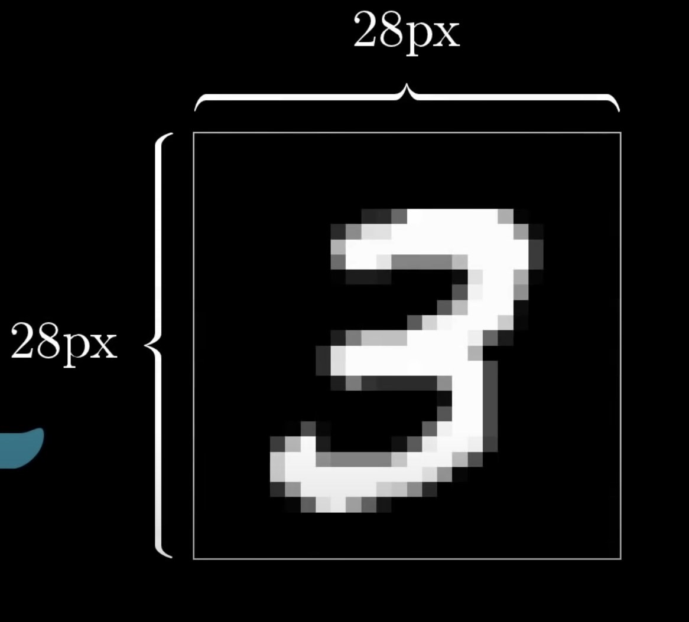

The particular light-sensitive cells in your eye that are firing when you see this three are very different from the ones firing when you see this three.

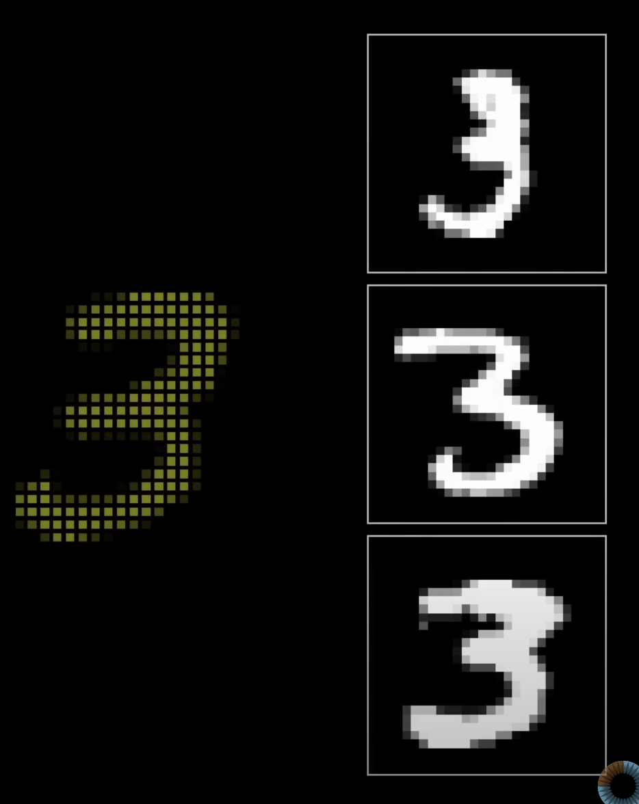

But something in that crazy smart visual cortex of yours resolves these as representing the same idea while at the same time recognizing other images as their own distinct ideas

But if I told you hey sit down and write for me a program that takes in a grid of 28 by 28 pixels like this and outputs a single number between 0 and 10 telling you what it thinks the digit is

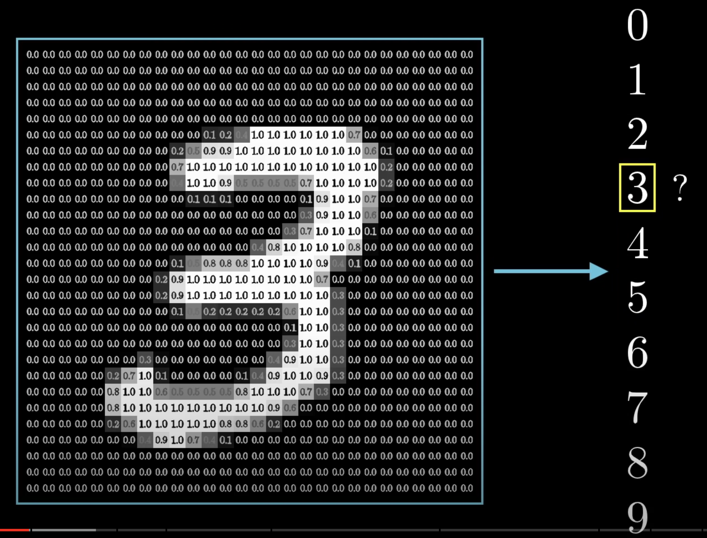

What a neural network actually is
What are neurons?

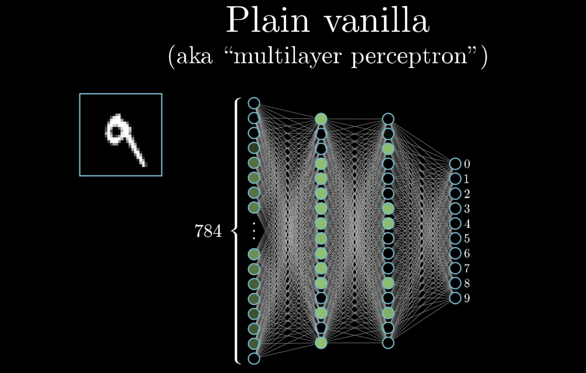

- inspired by the brain
    - linked together
    - thing that holds a number: 0 - 1

Our example:
    - starts with a bunch of neurons corresponding to each of the 28 times 28 pixels of the input image: 784 neurons 
        - each one of these holds a number:  activation and the image you might have in mind here
    - layers
        - 784 neurons make up the first layer
    - last layer ten neurons each representing one of the digits
        - the activation in these neurons? -> zero and one
    - hidden layers
        - how many? room for experiment 
        - why?

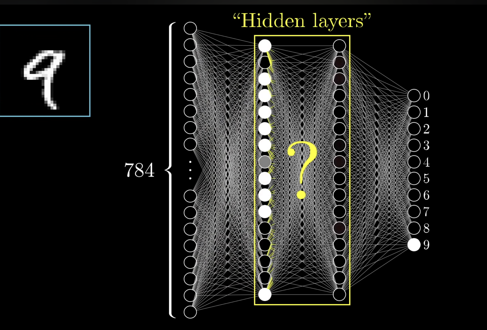
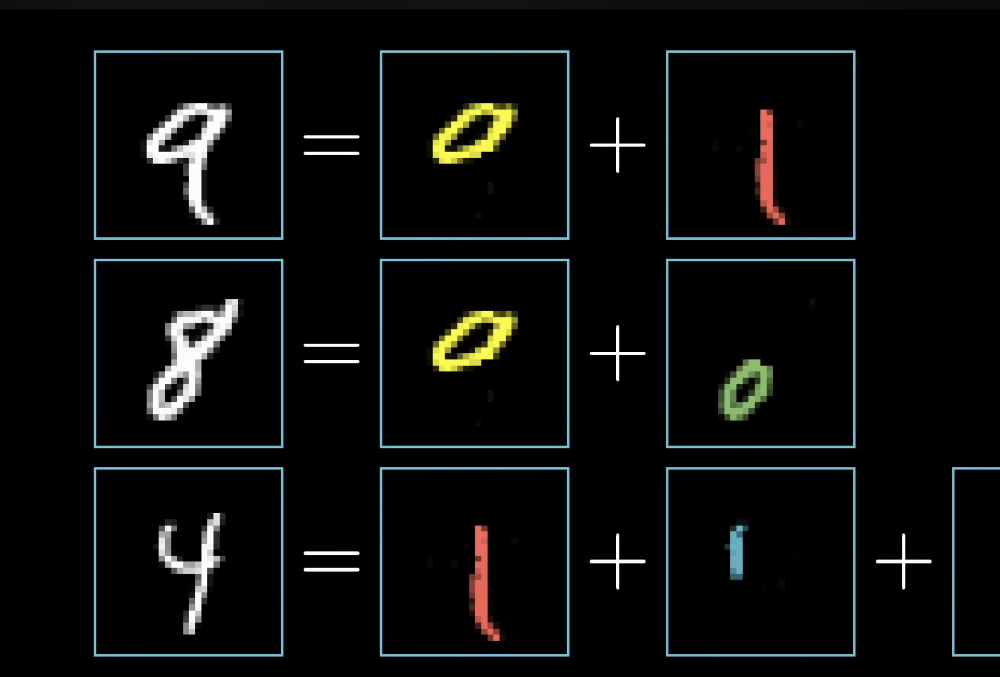
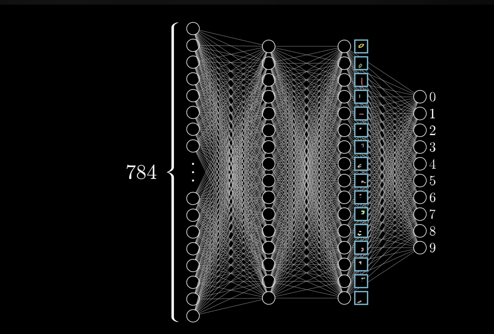

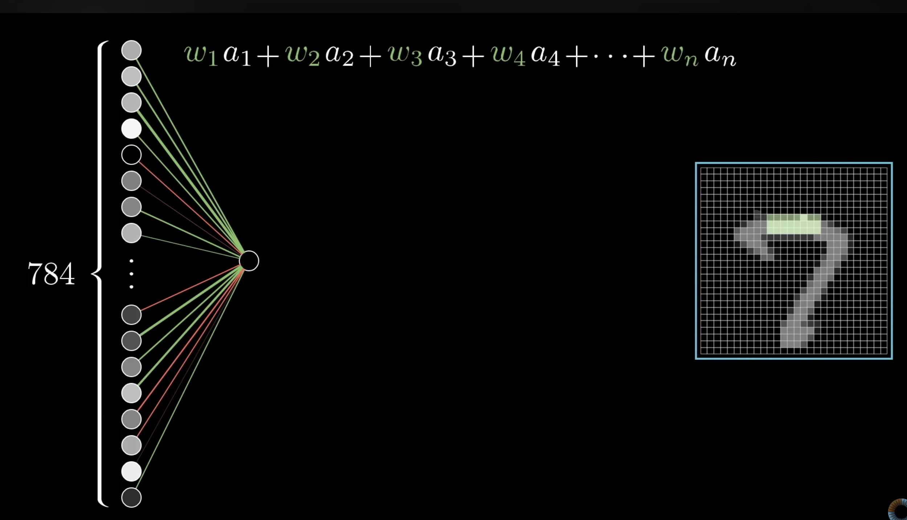
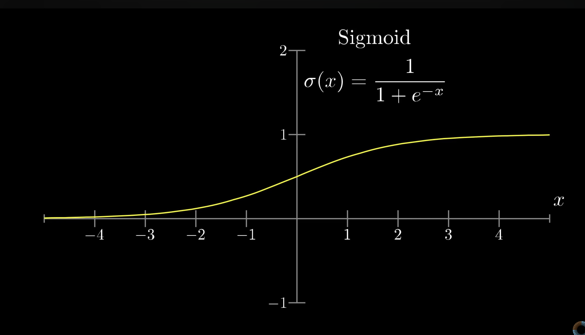
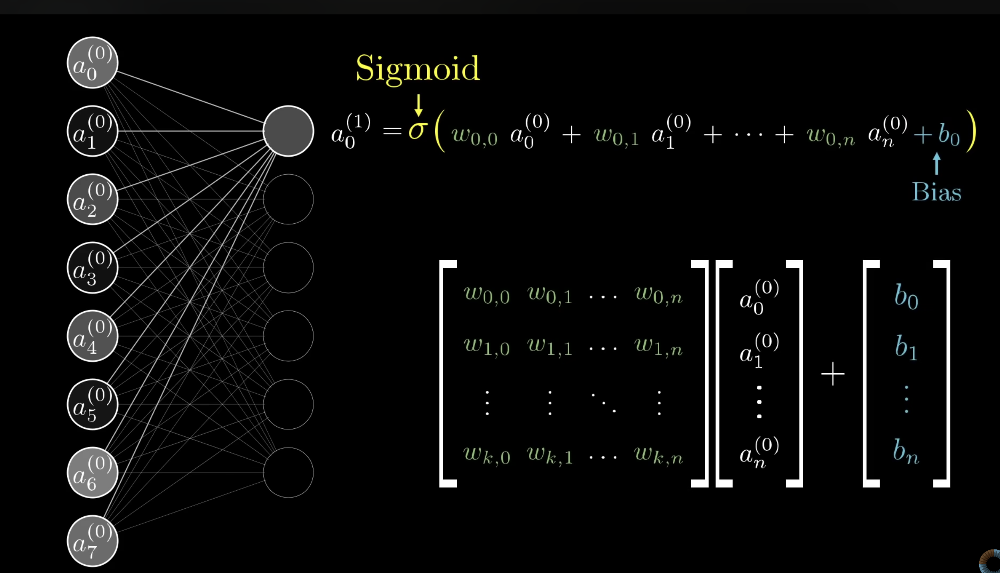
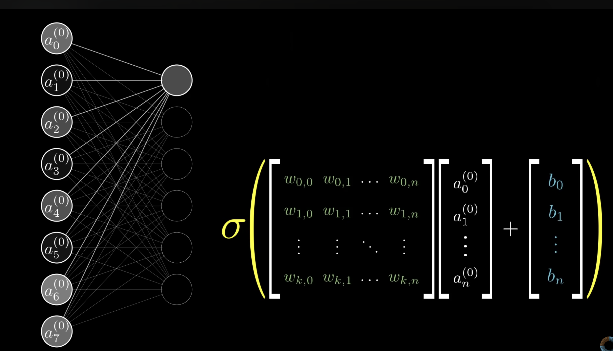

## >> [Agenda](agenda_.md)