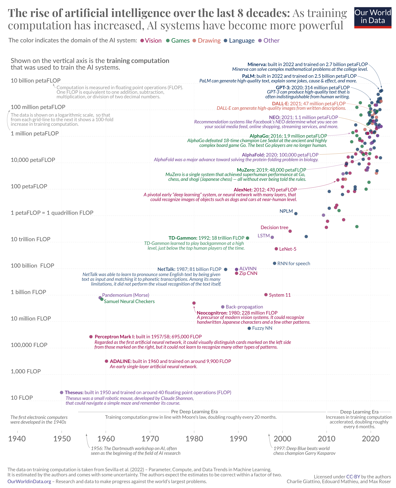

# 2023: Road To AGI

AGI stands for Artificial General Intelligence. It is a hypothetical type of artificial intelligence (AI) that would have the ability to learn and perform any intellectual task that a human being can. AGI is often contrasted with narrow AI, which is designed to perform a specific task, such as playing chess or Go.

AGI is a long-term research goal in AI. While there has been significant progress in recent years, there is no consensus on when or even if AGI will be achieved. Some experts believe that AGI is still decades away, while others believe that it could be possible within the next few years.

## To be Mentioned

- **MuZero**
    - Collaborating with YouTube to optimise video compression

**MuZero** is a reinforcement learning algorithm developed by DeepMind in 2019. It is a successor to AlphaZero, and it has been shown to be able to master a wider range of tasks, including Go, chess, shogi, and Atari games.

MuZero works by combining a number of different techniques, including:

* **Model-based reinforcement learning:** MuZero learns a model of the environment, which it can use to plan its actions.
* **Self-play:** MuZero plays against itself millions of times to generate training data.
* **Search:** MuZero uses a search algorithm to explore the possible outcomes of its actions.
* **Deep neural networks:** MuZero uses deep neural networks to represent its policy, value function, and model of the environment.

MuZero has been shown to be able to achieve superhuman performance in a wide range of tasks. It is a promising new approach to reinforcement learning, and it could have a significant impact on the development of artificial general intelligence.

Here are some of the key features of MuZero:

* **It can learn to play games without any prior knowledge of the rules.** This is in contrast to previous reinforcement learning algorithms, which required the rules of the game to be explicitly programmed into them.
* **It can generalize to new situations.** This means that it can learn to play a game even if it has never seen that particular configuration of the game before.
* **It is very efficient at learning.** MuZero can learn to play a game to a high level in a fraction of the time it takes for previous reinforcement learning algorithms.

## March
- **GPT-4**

- **PaLM by Google**
  - The model was first announced in April 2022 and remained private until March 2023, when Google launched an API for PaLM and several other technologies. The API will first be available to a limited number of developers who join a waitlist before being opened to the public.
  - PaLM-E [github demo](https://palm-e.github.io/#demo)
  - Med-PaLM

- **BloombergGPT**
  - LLM trained on financial data from proprietary sources, that "outperforms existing models on financial tasks by significant margins without sacrificing performance on general LLM benchmarks"
  

## April
- **GPT-4 Enanchements**
  - plugins
  - web browsing
## May
- **PaLM 2 by Google**
  - In May 2023, Google announced PaLM 2 at the annual Google I/O keynote. PaLM 2 is reported to be a 340 billion parameter model trained on 3.6 trillion tokens
- **BARD open to 180 Contriues**
  - but none of them is in EU
- **NVIDIA Stocks**
  - double price since 1 jan 2023 and plu 30% in 1 day 24/05/23 (dat eof writing 6/6/23)

## June
- **Stable Diffusion Founder vs Forbes**
  - The AI Founder Taking Credit For Stable Diffusion’s Success Has A History Of Exaggeration

## >> [Agenda](agenda_.md)